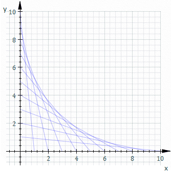

# Envelope
Perhaps one of the best known examples of an [envelope of a planar family of curves](https://en.wikipedia.org/wiki/Envelope_(mathematics)) is in string art. When cross-connecting two lines of equally spaced pins, as we increase the number of pins we notice that a curved boundary, tangent to the lines, is created.

  

Usually we obtain the equation for this curve using known properties of the envelope:

$$F\left(t,\ x,\ y\right)=0$$
$$\frac{dF}{dt}\left(t,\ x,\ y\right)=0$$

However, for this derivation, I am interested in finding a solution to the equation through a purely parametric approach.  

## References
<a href="https://www.desmos.com/calculator/krz2vv9eol" target="_blank" rel="noopener noreferrer">Desmos static graph</a> 
<a href="https://www.desmos.com/calculator/oce7bg1dar" target="_blank" rel="noopener noreferrer">Desmos dynamic graph</a>

 

## Setup

  

 

Let us start by defining two points $$a$$ and $$b$$ moving along the vertical and horizontal line respectively, and let vectors $$\vec{r_{a}\(t)}$$ and $$\vec{r_{b}\(t)}$$ represent their position. We know that these points have the same speed, and thus we have:

$$t \in [0, 1]$$

$$\vec{r_{a}}\(t)=
\begin{bmatrix}
    x_{1}+t\left(x_{0}-x_{1}\right)\\
    y_{1}+t\left(y_{0}-y_{1}\right)
\end{bmatrix}
$$

$$\vec{r_{b}}\(t)=
\begin{bmatrix}
    x_{0}+t\left(x_{2}-x_{0}\right)\\
    y_{0}+t\left(y_{2}-y_{0}\right)
\end{bmatrix}
$$

We can further simplify these vectors since we know that $$x_{0}=x_{1}$$ and $$y_{2}=y_{0}$$

$$\vec{r_{a}}\(t)=
\begin{bmatrix}
    x_{1}\\
    y_{1}+t\left(y_{0}-y_{1}\right)
\end{bmatrix}
$$

$$\vec{r_{b}}\(t)=
\begin{bmatrix}
    x_{0}+t\left(x_{2}-x_{0}\right)\\
    y_{0}
\end{bmatrix}
$$

 

We know that at every time $$t$$, a line is formed by the points $$a$$ and $$b$$. We also know that the envelope curve is tangent to each line at some point $$c$$. This means that at any time $$t$$, we can parametrize the line $$\vec{r_{l}}\(w)$$ with a parameter $$w$$, such that

$$\vec{r_{l}}\(w)=\vec{r_{a}}\left(t\right)+w\left(\vec{r_{b}}\left(t\right)-\vec{r_{a}}\left(t\right)\right)$$

and that for a unique value of $$w \in [0, 1]$$, which we will call $$w_{c}$$, $$\vec{r_{l}}(w_{c})$$ describes the position of $$c$$  

## Derivation

Now imagine that we have two lines. The first one is formed at time $$t$$ by the points 

$$\left(x_{a}\left(t\right),\ y_{a}\left(t\right)\right),\ \left(x_{b}\left(t\right),\ y_{b}\left(t\right)\right)$$

The second one is formed from the same points at time $$t + dt$$ 

$$\left(x_{a}\left(t+dt\right),\ y_{a}\left(t+dt\right)\right),\ \left(x_{b}\left(t+dt\right),\ y_{b}\left(t+dt\right)\right)$$ 

  

 

We know that these two lines intercept at a specific point $$p$$, which approaches $$c$$ as $$dt$$ approaches $$0$$. In order to find this point, we will parametrize the lines and solve the system of equations. Let us call the points riding along the lines $$d$$ and $$e$$, and their parameters $$s$$ and $$u$$ respectively, such that

$$\vec{r_{d}}\(s)=\vec{r_{a}}\left(t\right)+s\left(\vec{r_{b}}\left(t\right)-\vec{r_{a}}\left(t\right)\right)$$

$$\vec{r_{e}}\(u)=\vec{r_{a}}\left(t+dt\right)+u\left(\vec{r_{b}}\left(t+dt\right)-\vec{r_{a}}\left(t+dt\right)\right)$$

We can find the position of point $$p$$ by solving for the value of the parameters $$s$$ and $$u$$ at the point where the lines intercept

Let's expand the vectors

$$\vec{r_{d}}\(s)=
\begin{bmatrix}
    x_{1}\\
    y_{1}+t\left(y_{0}-y_{1}\right)
\end{bmatrix} + s
\big(\begin{bmatrix}
    x_{0}+t\left(x_{2}-x_{0}\right)\\
    y_{0}
\end{bmatrix} - 
\begin{bmatrix}
    x_{1}\\
    y_{1}+t\left(y_{0}-y_{1}\right)
\end{bmatrix}\big)
$$

$$\vec{r_{d}}\(s)=
\begin{bmatrix}
    x_{1}\\
    y_{1}+t\left(y_{0}-y_{1}\right)
\end{bmatrix} + s
\begin{bmatrix}
    x_{0}+t\left(x_{2}-x_{0}\right)-x_{1}\\
    y_{0}-y_{1}-t\left(y_{0}-y_{1}\right)
\end{bmatrix}
$$

again, we note that $$x_{0}=x_{1}$$

$$\vec{r_{d}}\(s)=
\begin{bmatrix}
    x_{0}\\
    y_{1}+t\left(y_{0}-y_{1}\right)
\end{bmatrix} + s
\begin{bmatrix}
    t\left(x_{2}-x_{0}\right)\\
    (y_{0}-y_{1})-t(y_{0}-y_{1})
\end{bmatrix}
$$

$$\vec{r_{d}}\(s)=
\begin{bmatrix}
    x_{0}\\
    y_{1}+t\left(y_{0}-y_{1}\right)
\end{bmatrix} + s
\begin{bmatrix}
    t\left(x_{2}-x_{0}\right)\\
    (1-t)(y_{0}-y_{1})
\end{bmatrix}
$$

$$\vec{r_{d}}\(s)=
\begin{bmatrix}
    x_{0}\\
    y_{1}+t\left(y_{0}-y_{1}\right)
\end{bmatrix} +
\begin{bmatrix}
    st\left(x_{2}-x_{0}\right)\\
    s(1-t)(y_{0}-y_{1})
\end{bmatrix}
$$

$$\vec{r_{d}}\(s)=
\begin{bmatrix}
    x_{0}\\
    y_{1}+t\left(y_{0}-y_{1}\right)
\end{bmatrix} +
\begin{bmatrix}
    st\left(x_{2}-x_{0}\right)\\
    (s-st)(y_{0}-y_{1})
\end{bmatrix}
$$

$$\vec{r_{d}}\(s)=
\begin{bmatrix}
    x_{0}+st\left(x_{2}-x_{0}\right)\\
    y_{1}+t\left(y_{0}-y_{1}\right)+(s-st)(y_{0}-y_{1})
\end{bmatrix}
$$

$$\vec{r_{d}}\(s)=
\begin{bmatrix}
    x_{0}+st\left(x_{2}-x_{0}\right)\\
    y_{1}+(s-st+t)(y_{0}-y_{1})
\end{bmatrix}
$$

Now we do the same for $$r_{e}\(t)$$

$$\vec{r_{e}}\(u)=
\begin{bmatrix}
    x_{1}\\
    y_{1}+(t+dt)\left(y_{0}-y_{1}\right)
\end{bmatrix} + u
\big(\begin{bmatrix}
    x_{0}+(t+dt)\left(x_{2}-x_{0}\right)\\
    y_{0}
\end{bmatrix} - 
\begin{bmatrix}
    x_{1}\\
    y_{1}+(t+dt)\left(y_{0}-y_{1}\right)
\end{bmatrix}\big)
$$

$$\vec{r_{e}}\(u)=
\begin{bmatrix}
    x_{0}\\
    y_{1}+(t+dt)\left(y_{0}-y_{1}\right)
\end{bmatrix} + u
\begin{bmatrix}
    x_{0}+(t+dt)\left(x_{2}-x_{0}\right)-x_{1}\\
    y_{0}-y_{1}-(t+dt)\left(y_{0}-y_{1}\right)
\end{bmatrix}
$$

$$\vec{r_{e}}\(u)=
\begin{bmatrix}
    x_{0}\\
    y_{1}+(t+dt)\left(y_{0}-y_{1}\right)
\end{bmatrix} + u
\begin{bmatrix}
    (t+dt)\left(x_{2}-x_{0}\right)\\
    (y_{0}-y_{1})-(t+dt)\left(y_{0}-y_{1}\right)
\end{bmatrix}
$$

$$\vec{r_{e}}\(u)=
\begin{bmatrix}
    x_{0}\\
    y_{1}+(t+dt)\left(y_{0}-y_{1}\right)
\end{bmatrix} + u
\begin{bmatrix}
    (t+dt)\left(x_{2}-x_{0}\right)\\
    (1-t-dt)\left(y_{0}-y_{1}\right)
\end{bmatrix}
$$

$$\vec{r_{e}}\(u)=
\begin{bmatrix}
    x_{0}\\
    y_{1}+(t+dt)\left(y_{0}-y_{1}\right)
\end{bmatrix} +
\begin{bmatrix}
    u(t+dt)\left(x_{2}-x_{0}\right)\\
    u(1-t-dt)\left(y_{0}-y_{1}\right)
\end{bmatrix}
$$

$$\vec{r_{e}}\(u)=
\begin{bmatrix}
    x_{0}\\
    y_{1}+(t+dt)\left(y_{0}-y_{1}\right)
\end{bmatrix} +
\begin{bmatrix}
    u(t+dt)\left(x_{2}-x_{0}\right)\\
    (u-ut-udt)\left(y_{0}-y_{1}\right)
\end{bmatrix}
$$

$$\vec{r_{e}}\(u)=
\begin{bmatrix}
    x_{0}+u(t+dt)\left(x_{2}-x_{0}\right)\\
    y_{1}+(t+dt)\left(y_{0}-y_{1}\right)+(u-ut-udt)\left(y_{0}-y_{1}\right)
\end{bmatrix}
$$

$$\vec{r_{e}}\(u)=
\begin{bmatrix}
    x_{0}+u(t+dt)\left(x_{2}-x_{0}\right)\\
    y_{1}+(t+dt+u-ut-udt)\left(y_{0}-y_{1}\right)
\end{bmatrix}
$$

Now let us solve the sytem of equations, starting with the x-component and solving for $$s$$

$$x_{0}+st\left(x_{2}-x_{0}\right)=x_{0}+u\left(t+dt\right)\left(x_{2}-x_{0}\right)$$

$$\big\[x_{0}+st\left(x_{2}-x_{0}\right)=x_{0}+u\left(t+dt\right)\left(x_{2}-x_{0}\right)\big\] -x_{0}$$

$$st\left(x_{2}-x_{0}\right)=u\left(t+dt\right)\left(x_{2}-x_{0}\right)$$

$$st=u\left(t+dt\right)$$

$$s=u\left(1+\frac{dt}{t}\right)$$

We do the same fot the y-component

$$y_{1}+(s-st+t)(y_{0}-y_{1}) = y_{1}+(t+dt+u-ut-udt)\left(y_{0}-y_{1}\right)$$

$$\big\[y_{1}+(s-st+t)(y_{0}-y_{1}) = y_{1}+(t+dt+u-ut-udt)\left(y_{0}-y_{1}\right)\big\] -y_{1}$$

$$(s-st+t)(y_{0}-y_{1}) = (t+dt+u-ut-udt)\left(y_{0}-y_{1}\right)$$

$$(s-st+t) = (t+dt+u-ut-udt)$$

$$\big\[s-st+t = t+dt+u-ut-udt\big\] -t$$

$$s-st = dt+u-ut-udt$$

$$s(1-t) = u(1-t-dt) + dt$$

$$s(1-t) -u(1-t-dt) = dt$$

$$s(1-t) +u(t+dt-1) = dt$$

Let us substitute $$s=u\left(1+\frac{dt}{t}\right)$$

$$u(1+\frac{dt}{t})(1-t) +u(t+dt-1) = dt$$

$$u(1-t+\frac{dt}{t}-dt)+u(t+dt-1) = dt$$

$$u(1-t+\frac{dt}{t}-dt+t+dt-1)=dt$$

$$u\frac{dt}{t}=dt$$

$$udt=tdt$$

$$u=t$$

and

$$s=u\left(1+\frac{dt}{t}\right)$$

$$s=t\left(1+\frac{dt}{t}\right)$$

$$s=t+t\frac{dt}{t}$$

$$s=t+dt$$

$$s=\lim_{dt\to0}(t+dt)=t$$

This results in a very interesting solution, since it turns out that $$w_{c}$$ ends up being $$t$$, yielding the following parametric representation of the envelope curve

$$\vec{r_{c}}\left(t\right)=\vec{r_{a}}\left(t\right)+t\left(\vec{r_{b}}\left(t\right)-\vec{r_{a}}\left(t\right)\right)$$

We can see that as the point $$a$$ is $$(t\cdot100)$$% along the vertical segment, $$b$$ is also $$(t\cdot100)$$% along the horizontal segment, and $$c$$ is also $$(t\cdot100)$$% along the line formed by $$a$$ and $$b$$ at any time $$t$$, which is the exact behaviour a Bezier curve would show. As it turns out, this is in fact the Bezier curve that would be generated given the points 

$$(x_{1}, y_{1}), (x_{0}, y_{0}), (x_{2}, y_{2})$$

We still want to find implicit equation for the curve. Let us continue by expanding $$r_{c}(t)$$

$$\vec{r_{c}}\(t)=
\begin{bmatrix}
    x_{1}\\
    y_{1}+t\left(y_{0}-y_{1}\right)
\end{bmatrix} + t
\big(\begin{bmatrix}
    x_{0}+t\left(x_{2}-x_{0}\right)\\
    y_{0}
\end{bmatrix} - 
\begin{bmatrix}
    x_{1}\\
    y_{1}+t\left(y_{0}-y_{1}\right)
\end{bmatrix}\big)
$$

$$\vec{r_{c}}\(t)=
\begin{bmatrix}
    x_{0}\\
    y_{1}+t\left(y_{0}-y_{1}\right)
\end{bmatrix} + t
\begin{bmatrix}
    x_{0}+t\left(x_{2}-x_{0}\right)-x_{1}\\
    y_{0}-y_{1}-t\left(y_{0}-y_{1}\right)
\end{bmatrix}
$$

$$\vec{r_{c}}\(t)=
\begin{bmatrix}
    x_{0}\\
    y_{1}+t\left(y_{0}-y_{1}\right)
\end{bmatrix} + t
\begin{bmatrix}
    t\left(x_{2}-x_{0}\right)\\
    (y_{0}-y_{1})-t\left(y_{0}-y_{1}\right)
\end{bmatrix}
$$

$$\vec{r_{c}}\(t)=
\begin{bmatrix}
    x_{0}\\
    y_{1}+t\left(y_{0}-y_{1}\right)
\end{bmatrix} + t
\begin{bmatrix}
    t\left(x_{2}-x_{0}\right)\\
    (1-t)\left(y_{0}-y_{1}\right)
\end{bmatrix}
$$

$$\vec{r_{c}}\(t)=
\begin{bmatrix}
    x_{0}\\
    y_{1}+t\left(y_{0}-y_{1}\right)
\end{bmatrix} + 
\begin{bmatrix}
    t^2\left(x_{2}-x_{0}\right)\\
    t(1-t)\left(y_{0}-y_{1}\right)
\end{bmatrix}
$$

$$\vec{r_{c}}\(t)=
\begin{bmatrix}
    x_{0}\\
    y_{1}+t\left(y_{0}-y_{1}\right)
\end{bmatrix} + 
\begin{bmatrix}
    t^2\left(x_{2}-x_{0}\right)\\
    (t-t^2)\left(y_{0}-y_{1}\right)
\end{bmatrix}
$$

$$\vec{r_{c}}\(t)=
\begin{bmatrix}
    x_{0}+t^2\left(x_{2}-x_{0}\right)\\
    y_{1}+t\left(y_{0}-y_{1}\right)+(t-t^2)\left(y_{0}-y_{1}\right)
\end{bmatrix}
$$

$$\vec{r_{c}}\(t)=
\begin{bmatrix}
    x_{0}+t^2\left(x_{2}-x_{0}\right)\\
    y_{1}+(2t-t^2)\left(y_{0}-y_{1}\right)
\end{bmatrix}
$$

Now let us introduce a constant $$k$$ which is equivalent to the lenght of the vertical and horizontal segments, such that

$$x_{2}-x_{0}=k$$

$$y_{0}-y_{1}=-k$$

$$y_{1}=k+y_{0}$$

After substituting we have

$$\vec{r_{c}}\(t)=
\begin{bmatrix}
    x_{0}+t^2k\\
    y_{0}+k+(2t-t^2)(-k)
\end{bmatrix}
$$

$$\vec{r_{c}}\(t)=
\begin{bmatrix}
    x_{0}+t^2k\\
    y_{0}+k+(t^2-2t)k
\end{bmatrix}
$$

$$\vec{r_{c}}\(t)=
\begin{bmatrix}
    t^2k+x_{0}\\
    (t^2-2t)k+k+y_{0}
\end{bmatrix}
$$

$$\vec{r_{c}}\(t)=
\begin{bmatrix}
    t^2k+x_{0}\\
    (t^2-2t+1)k+y_{0}
\end{bmatrix}
$$

Finally, let us find the equation

$$\vec{x_{c}}(t)=t^2k+x_{0}$$

$$\vec{y_{c}}(t)=(t^2-2t+1)k+x_{0}=(t-1)^2k+y_{0}$$

Solve for $$t$$

$$t=\pm\sqrt{\frac{x-x_{0}}{k}}$$

$$t=1\pm\sqrt{\frac{y-y_{0}}{k}}$$

$$\pm\sqrt{\frac{x-x_{0}}{k}}=1\pm\sqrt{\frac{y-y_{0}}{k}}$$

$$\pm\sqrt{\frac{x-x_{0}}{k}}\pm\sqrt{\frac{y-y_{0}}{k}}=1$$

We keep the positive roots

$$\sqrt{\frac{x-x_{0}}{k}}+\sqrt{\frac{y-y_{0}}{k}}=1$$

$$\big\[\sqrt{\frac{x-x_{0}}{k}}+\sqrt{\frac{y-y_{0}}{k}}=1\big\]\sqrt{k}$$

Yielding

$$\sqrt{x-x_{0}}+\sqrt{y-y_{0}}=\sqrt{k}$$

 

  

